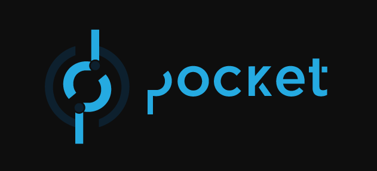

<h1 align="center">Local Development Setup</h1>
<p align="center">
    
</p>
<p align="center">This is a local development setup with all of the pocket tools in development mode to allow for feature development, debugging and higher flexibility when   dealing with the stack.
</p>
</br>
<h1 align="center">User guide</h2>


<h2 align="center">How to use</h2>


### Launching the pocket foundation stack
<br/>

##### 1. Properly configure the gateway

Make sure you are on the `dev/make-use-locally` branch on the gateway repository.

Make sure you follow the proper instructions to replicate the production databse locally (_check the gateway README.md_)****

Afterwards, add this entry to your applications collection in the gateway's database:

```
/** 
* Paste one or more documents here
*/
{
    "id": "607d9f3064c40bc97ff5cb81",
    "name": "localnet-app",
    "owner": "pocket-foundation",
    "url": "https://pokt.network",
    "freeTier": true,
    "publicPocketAccount": {
        "address": "4187e3aed3d9ce89aec2519636a599d42c36521a",
        "publicKey": "50952e091c442cc891b7238a902dcdb53b6a42ffb21e2678ebc5caad91cc9113"
    },
    "freeTierApplicationAccount": {
        "address": "4187e3aed3d9ce89aec2519636a599d42c36521a",
        "publicKey": "50952e091c442cc891b7238a902dcdb53b6a42ffb21e2678ebc5caad91cc9113",
        "privateKey": "aHInaopP52ZTDfj1rBqT4A17iRACKw2DoPo0w9VYp+9GxHQzuKfqSLwkrCxsi8Aca9DCZhC9v0RFiaX/T44bc8v0BcNtTz0Z7i+vjLMrsHUEVWeO29wYVZCRAFxDIAjT1ONXZxUdVxv4OpYwehlrjyuprjuiPjYCKDbE28L/8MZpgo+el+hfskTmKYpL95rliAZZKqz9VAFhFyPNcXtFfq"
    },
    "contactEmail": "hamza@pokt.network",
    "user": "ouaghad.hamza@gmail.com",
    "description": "",
    "icon": "data:image/png;base64,iVBORw0KGgoAAAANSUhEUgAAAP8AAADFCAMAAACsN9QzAAAA+VBMVEUIHiz///8AAAAIHiskqeEJHSwlreYGEh8AABkDDBcbbpIAAAskjb0AGyoJHi0jo9YAABYijroor+UAABEADiEAFSUAABsHGCUAAAoAFCYIGycUUW4msuohha8GDRsACh8OLkQefaaGjZPBxcgdLTnJztEaYoQmqeQFEBvl6OkRSGIimMq0ur0GEyJGUVgsOUR+h41SWmICot2Tmp8AAB9mcHjZ3+A9R1FeaG6bn6RGUVobWHhtb3FyeoALM0kAXIUOJTkNNE0AFS4UPFcMKzoba5EQOEoSRFkUTGkglL4YWXIbbIoAL0ohdaC2vL8AR2s3ODxRs+AkMj0w4DjUAAAJs0lEQVR4nO2cC3faRhbHB41GQggJWQ+EBEjGGCEesnGpTYgLpQU/0qzZ3Xz/D7N3RsSY7KZtzqmjLr6/c5LYoxGZ/9ynRokJQRAEQRAEQRAEQRAEQRAEQRAEQRAEQRAEQRAEQRAEQRAEQRAEQRAEQRAEQRAEQRAEOTqoSSk1i15FYTDCAFr0MgrDzO5sWYne7gaoFUW2I1b0MorCRP2oH/W/Qf2ewX/P9VtvTn8sXVzyDRD6lSupbpC30wQxtzwZlK48stP/Q6k09X58Mz5gSNeDUulQf6l0JhlFL+z7EMQ9rvdL/aWbT3HRS/seuJcDIbc0e47/H3YjV/WiF/f6uJe51qnFzU9odqcoirTId+Bd/XWSIGOalr7KJ38r3rkQ2jXKYP3QVzPtadSuBbE1F+Pv3Vf5W9npSbXtv8pHfxumNNjlOpP5zqaZfLyNf5rPApPpV2IDiPG7j4KUPzF/+ZliZOc4JtnXUfY8NTxt9Wt/BwdwhJkXukn86HYEnt9qT2DgHJyhPuOXetLv6mehHx4M+KGfyzRpGMIX1A/D3Qzq+/5uB8JTu19TD+8sAk9onDYIVZejliLLsvIzLwYL7vax8IDrr0YANX39dNh80NL8vMSkLPWHzeHG4Z5NV+uHDSXZL+v1ml+nWbRuPm60UJwwcf3RarUquMeQesLExMweZFDfl+1W5wyGPonS70zhy4Hz1bujJvcYW66EAf+WeqQjw4AyGqb8HKHVusuyJrjUbz4xw/hjjV87+SVjVBvBXTVJUTrFxkBufsOg/n3fBuPbo3a7+utifOEKgzJ98NkXDvA1fplqnZaQK9s/bLjFw2XNFgNK605lUEftRLuHHU0ik1Gr3edXbMV+CJlTg82uSa1WR/3ekg+oj0Hf3CIsGnHrj+4jLU2JW/cIFUHsvuPu4Rw6KVXXNe630ZMt29Uk6dh9peZRFrKarchPt3fgFBUV7G8ryaomK50GhEZUgf1NlsOqbcvwCXdwU81qt2+LrQHWIM91/m8gXznR9gnJ32z4N6I6BId9sN9U7HZEwnulb986qqotZVvpuDR9Ak0bLVWdSscS52h2An5e1WAr2Uax7WXq+1JVse9Slq54/ovSYuUL9+/phGjc/DILP1cq6t7XRhrYuD797wDwH1p9e8WijmJ3uGvQqKn0a0GYQvysM2KaLFNpfo4I0VATh8m8qXrSMz/LNpAeNMj/cEvGRP0sjpiXujNo8ld9WGoner6gNmHl3DcDvkPj8sFdpg5O/RBEo74yFPajMADK14pc0/Z6hH5ZXmb8m+ikr1SaAvibfF7/5Jpa9CFznRf/mUf8IQSn0tw746oFpWAUUcJikQAOb0vBh5t+Cl6/4ZmBmVpVVh7TW0WpavtUkdt/GPEmABwM0ktLoNitDcvr//dR+XWsLqgDF4aIhqXe7/VHHdiQ1tInjCeAgXRwF2uM5NbQj2p9Zc1zhEn0EQhNh4o8cvaPC1x/K2kMT/kc7UTpf6ju+ACt0d9Cv8Orv871c/sPX2S/B74hiQq+LqbshnNx/hIumiw6UewnjfC2DpKbbIYmVEMQSyk8RpA8/3X0lV11ePxDskgkjaNrEdv1f0W/ZuLiBg1YzQPot5Ps+QKjvBOspIQ6wkV2wyHkryzzwdptSGG3kAaX4N6ZXrX7JxqNoLZVGyFj6jLRdvnfabf6d5AUQtjQWgydMdOGIciG/GfLkZ/5hfZ/wv6gnwq5Jy/CPKjxhAj6xRbt/D8c8vxVgbjv88ee6IPdl++Wp0MocvYmZLCLfaX6eLr8KPc/hkS9A/3RKcyGOKLgLf3ROtI2T8poxd8xQidUWTebhT4CWLz94Ue9EJ6wzsd9AjB39icNiP+bnf/DrLzdkx9Eu7cSDa3o6h55LEcJb+9k3uS1of+Dkpf4amLLo4wyCs2RbNdqsFUK3E0dqLiiTyxE+I6YV/cL6N29IST8D5tnZ/SHPP6hbTc8mLG18lHQb3Nx1VXutr7ftoX60X0eOuljviPyR4uYKfT/kEH0KnS5kUlC1m7x25XRqU+J6a9hq5TWi5grAI8/4E3r4MvOidJ5rl2UOW3QDz5Ngqtdh8AB/dXk7naj0TxxUaadJp1OZR19dhw/fax0OrcmqDL9hyS5D6HzS24T8VpdWyZPMFlj1ISI81dJpTL0Cz1jN1x+yinxg4lV0ngeZtojrwdV6IfKvEO43PW/oL8tqf7LpM1SNTsY8dMoDfON9H3xgM9UNaO7yWmkPsdYqKZZ0QcAIrvP+LlfmJn8DRCDDJ9qCSQ26OhCk+mlF+Wf649M88BkJiEH70nAtM9N9Oexz8c+UBnpy5ms8BcsAX++2+6aFuZczMpJkjyN+KNwi8dDfbILEIHQX9xiXwPxfDcLhFmsLYR6heczsH6rDfKNOD8e2E3O7V/gav963GtxwsMVGuIg+B888UFlEp2dtOXmf376OUL9tMFboK3EVfFkOPhniztAda1BqDr8JGygP08+Qv3EMLnV55JBTPfqpvevpN3uJNDVQh5rLEq79mCHVj0+/cQVh7xdJ6BR5+eko0VRFvB8bUi8OSpNXjz7p+1aRz02/aQszDx439BHCq/5oi55zka8E53rL2bSTP87vLL4q3EW+RuwGTzXVTUxZHzK335NpT+49/8f6GfK7/M3oP9+1q/nA9dfP/o/Ktx4fKCfNcSbr/M38fqfYziz7hf6b97pXtHL+o54+vl07//ufCYFf3DHsWFI+/zH6kGxJ/NFoO31m0dX5f8E+l7/m0RD/W9af+Nt62faSGm9Yf0mexgO18GbK3t7Qt8v+kAWQRAEQRAEQRAEQRAEQRAEQRAEQRAEQRAEQRAEQRAEQZC/CPbFn28FSgPDYp7nuoxk8Cv2qGcYrlH38n8sHgdmTAJiuswLiGvELvE844h+drJxeTPfOoveduLW5/N6ufvemc/ozbwnfmAyqZ91x3Opa5W78WIi9ebdiXPdG09e5wfHFkFwOZa6LtdmedtubG179fnsvCvpN7HJd6cn6Q2n51i9HydnUk+SeueLqXQ88k3vcjDfWoteb1afLCYLaXzZnYJ+y+lR8HLveq6fzaUebEGd63fq83c/3YwvjycAjBnYf7aYzBdSbzrtStvGdekS7D/r8R8OYBg3Lli9d+ne6KD/RvJu4sWZdET/d9g4723Pyu8WjfH5VG/MvWmmzy9ptzs+FzYOLrbbSfyp272I31074+74Ir7qdc+OJgBMYljlmEBurxsxMWMGUR8b1LJ+3Ll4UC67xChbHglgjlX2zMAqH438P4X5P79EEARBEARBEARBEARBEARBEAT5dv4Dm3fpEkgdYkMAAAAASUVORK5CYII=",
    "updatingStatus": false,
    "freeTierAAT": {
        "version": "0.0.1",
        "clientPublicKey": "50952e091c442cc891b7238a902dcdb53b6a42ffb21e2678ebc5caad91cc9113",
        "applicationPublicKey": "50952e091c442cc891b7238a902dcdb53b6a42ffb21e2678ebc5caad91cc9113",
        "applicationSignature": "043170ab40ef8cbaf993fa2a646c4a67902f577afffd71ce845d23644f95482465bbcb6e4bd8e9bbc4cb4f130decad2b154f159f782ffd13dacb3d8335a81704"
    },
    "gatewayAAT": {
        "version": "0.0.1",
        "clientPublicKey": "e7e91202573bdd1927b00fce9b0b46fa7944b06e6fe1bc987abc86e4d0dd47d6",
        "applicationPublicKey": "abc07a64080fe578c766cb8c6e54278c84b1fd90113755e95cb24046d851967d",
        "applicationSignature": "14b3f302785bd2cb094a6684eeb198468ece5d03a4b47bcd13b27cfd06c29cbbd53b8966cd279c7c486e6cb5f47e0c9183d9d60cb8cd65b07dfb7c0ee5ce2004"
    },
    "gatewaySettings": {
        "secretKey": "ab23e67b08c7f76b04743e9c8ae2e751",
        "secretKeyRequired": false,
        "whitelistOrigins": ["Moonbase", "http://localhost:3001", "http://localhost"],
        "whitelistUserAgents": []
    }
}
```

Afterwards, make sure you add the blockchains you are concerned with to the `blockchains` collection as you have added them to the chains.json in `config/chains.json` in this project.


##### 2. Bring the pocket foundation stack up


```bash
$ GATEWAY_REPO_PATH=YOUR_LOCAL_GATEWAY_REPO_PATH make up-pokt-fdt 
```

Similarly, bring it down using:
```bash
$ GATEWAY_REPO_PATH=YOUR_LOCAL_GATEWAY_REPO_PATH make down-pokt-fdt 
```

### Launching the pocket network stack

##### 1. Launch the stack in production mode by using the dockerhub official pocket core production image (_currently at RC-0.6.3_)
```bash
$ make up-pokt-net-prod
```

Similarly, bring it down using:
```bash
$ make down-pokt-net-prod 
```
##### 2. Launch the stack in development mode by linking your local repository of pocket-core and building from it and benefiting from hot reload features 

```bash
$ POCKET_CORE_REPO_PATH=_path_to_your_local_version_of_pocket_core_ make up-pokt-net-dev
```
Similarly, bring it down using:
```bash
$ make down-pokt-net-prod 
```

### Launching the pocket app solutions stack

_Incoming_
```

```

```

```

### Launching it all together

> Since we do not want to clutter the SDK with docker specific files, this repo is where you'd find the development docker image for pocketjs, still there are a few things you have to introduce to pocketjs to make it smoothly work:
> 1.  update tsconfig.json to exclude `dist` directory
> 2. create a `.dockerignore` file in pocketjs directory and ignore `./node_modules` and `./dist` directories

_pocket app solutions stack (_pocket-js_) + pocket foundation stack (_gateway + dependencies_) + pocket network stack (_a localnet pocket-core fullnode_)_

##### 1. Develping against a dockerhub production image of pocket-core
```bash
$ GATEWAY_REPO_PATH=GW_PATH CWD=_LOCALNET_REPO_PATH POCKETJS_REPO_PATH=POCKETJS_REPO_PATH make up-pokt-all-prod
```

Similarly, bring it down using:
```bash
$ GATEWAY_REPO_PATH=GW_PATH CWD=_LOCALNET_REPO_PATH POCKETJS_REPO_PATH=POCKETJS_REPO_PATH make down-pokt-all-prod
```

##### 2. Developing against a local version of pocket-core with hot reload
```bash
$ POCKET_CORE_REPO_PATH=_LOCAL_POCKET_CORE_REPO_PATH_ GATEWAY_REPO_PATH=GW_PATH CWD=_LOCALNET_REPO_PATH POCKETJS_REPO_PATH=POCKETJS_REPO_PATH make up-pokt-all-dev
```

Similarly, bring it down using:
```bash
$ POCKET_CORE_REPO_PATH=_LOCAL_POCKET_CORE_REPO_PATH_ GATEWAY_REPO_PATH=GW_PATH CWD=_LOCALNET_REPO_PATH POCKETJS_REPO_PATH=POCKETJS_REPO_PATH make down-pokt-all-dev
```

### Configure new accounts

_incoming_
```
```

### How to contribute

_incoming_
