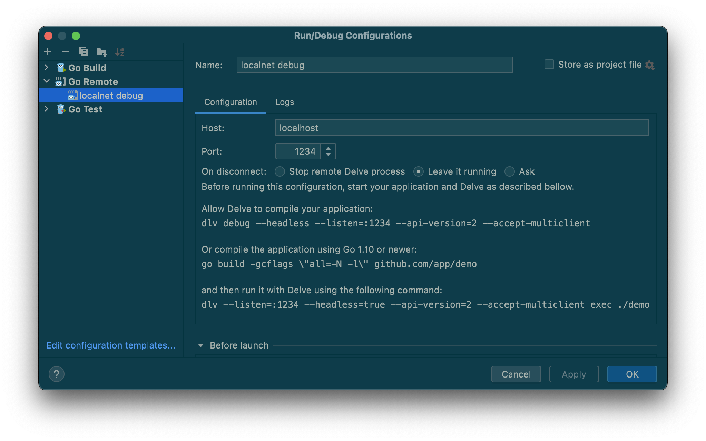

<h1 align="center">Local Development Setup</h1>
<p align="center">
    
</p>
<p align="center">This is a local development setup with all of the pocket tools in development mode to allow for feature development, debugging and higher flexibility when   dealing with the stack.
</p>
</br>
<h1 align="center">User guide</h2>

<h2 align="center">Getting Started Quickly</h2>

For quick usage, to use a 5 node setup of pocket network run:

```
$ bin/pkt-stack pokt-net prod-local up
```

To run the portal-api alongside the wallet/explorer against the 5 node setup, run:

```
$ bin/pkt-stack pokt-fdt prod-local up
```

<h2 align="center">Dependencies</h2>

- [Docker Compose](https://docs.docker.com/compose/)
- [Git](https://git-scm.com/book/en/v2/Getting-Started-Installing-Git)
- [Make](https://www.gnu.org/software/make/) (please upgrade your pre-installed Make version to `GNU Make 3.81`)

In order to run this tool, you first need to clone the following repositories:

- [portal-api](https://github.com/pokt-foundation/portal-api)

- [pocket-core](https://github.com/pokt-network/pocket-core)

- [pocket-js](https://github.com/pokt-network/pocket-js)

By default, the repositories are expected to be in the same directory as the E2E stack. If they're not, you can configure their location in a `.env` file as detailed below.

<h2 align="center">How to use</h2>

```bash
bin/pkt-stack STACK_NAME ENV ACTION
```

Available stacks:

- pokt-net: _Pocket Network stack as a localnet_
- pokt-fdt: _Pocket Foundation stack: portal-ui (missing), portal-api, wallet (missing), explorer (missing)_
- pokt-aps: _Pocket App Solutions stack: pocket-js_
- pokt-all: _Aggregates all previous stacks into one inter-connected stack_

Available envs:

- prod: _Production dockerhub imges_
- dev: _Local development mode, includes hot-reloading features, and a local net_

Available actions:

- up: _Spins up the stack_
- down: _Spins down the stack_
- config: _Prints out the resulting docker compose config file_

## Launching the pocket foundation stack

### 1. Properly configure the gateway

Make sure you follow the proper instructions to replicate the production database locally (_check the [portal-api](https://github.com/pokt-foundation/portal-api) README.md_)

Once you have properly setup the `portal-api` database with production data, add a new entry in the "Applications" collection in the gateways database with the values located in: `pocket-e2e-stack/assets/mongo-db-app.json`

Then, make sure you add the blockchains you are concerned with to the `Blockchains` collection and you have added them to the chains.json in `config/chains.json` in this project.

Run `cp .env.template .env` and update the file locally, if necessary.

```
GATEWAY_REPO_PATH=../portal-api
POCKETJS_REPO_PATH=../pocket-js
POCKET_CORE_REPO_PATH=../pocket-core
```

(_These are the default locations assuming you have cloned all the repos to one folder, but update the `.env` if you have cloned to the repos to another location._)

### 2. Bring the pocket foundation stack up

You can specify which environment you would like to run:

- dev: a local live development version with hot reloading
- prod: pulls the official production image

```bash
$ bin/pkt-stack pokt-fdt ENV up
```

Similarly, bring it down using:

```bash
$ bin/pkt-stack pokt-fdt ENV down
```

### Launching the pocket network stack

##### 1. Launch the stack in production mode by using the dockerhub official pocket core production image (_currently at RC-0.6.3_)

- dev: a local live development version with hot reloading
- prod: pulls the official production image

```bash
$ bin/pkt-stack pokt-net ENV up
```

Similarly, bring it down using:

```bash
$ bin/pkt-stack pokt-net ENV down
```

##### 2. Launching the pocket app solutions stack

_Incoming_

```bash
$ bin/pkt-stack pokt-aps ENV up
```

Similarly, bring it down using:

```
$ bin/pkt-stack pokt-aps ENV down
```

### Launching it all together

> Since we do not want to clutter the SDK with docker specific files, this repo is where you'd find the development docker image for pocketjs, still there are a few things you have to introduce to pocketjs to make it smoothly work:
>
> 1.  update tsconfig.json to exclude `dist` directory
> 2.  create a `.dockerignore` file in pocketjs directory and ignore `./node_modules` and `./dist` directories

_pocket app solutions stack (\_pocket-js_) + pocket foundation stack (_gateway + dependencies_) + pocket network stack (_a localnet pocket-core fullnode_)\_

You can specify which environment you would like to run:

- dev: pocket-core, portal-api and pocket-js are launched in local development and hot reloading mode allowing you to change code on the fly
- prod: pulls official production images

```bash
$ bin/pkt-stack pokt-all ENV up
```

Similarly, bring it down using:

```bash
$ bin/pkt-stack pokt-all ENV down
```

### Debugging (by example)

Some configurations such as `pokt-net dev-tm` enable debugging using Delve and support hot reloading.

You can run a debugging stack with this command: `./bin/pokt-net-dev-tm.sh`.

#### Cmdline

```
dlv connect localhost:1234
```

#### Goland

Create a new configuration like the following:



### Configure new accounts

_incoming_

```

```

### How to contribute

_incoming_

###
